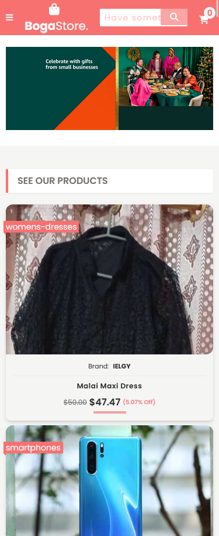
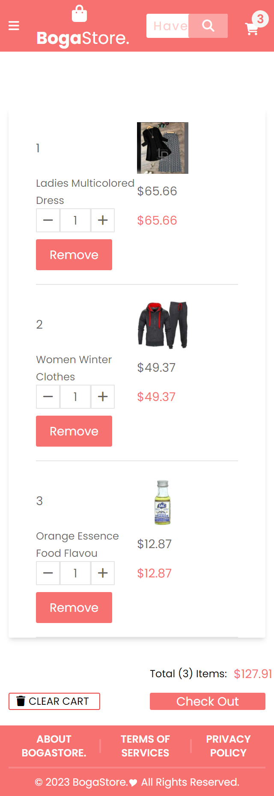
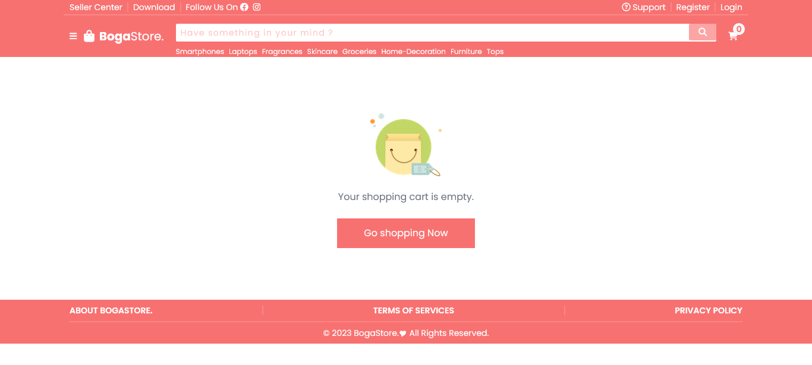
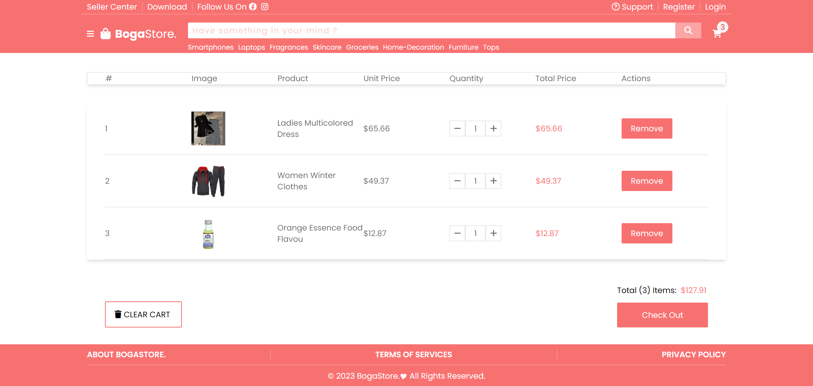

# Simple Ecommerce training

This is my first E-commerce project using ReactJs

## Table of contents

- [Overview](#overview)
  - [Features](#features)
  - [Links](#links)
  - [Built with](#built-with)
  - [What I learned](#what-i-learned)
  - [Continued development](#continued-development)
  - [Author](#author)
  - [Screenshot](#screenshot)

## Overview

### Features

Users should be able to:

- View the optimal layout for the app depending on their device's screen size
- See hover states for all interactive elements on the page
- View all products
- View products by category
- Search for products
- Add products to the shopping cart

### Links

- Live Site URL: [@via Vercel](https://my1st-react-app.vercel.app/)
- Live Site URL: [@via Netlify](https://my1st-react-app.netlify.app/)

### Built with

- [React](https://reactjs.org/) - JS library
- [Vite](https://vitejs.dev/) - Build tool
- [ReduxJs/toolkit](https://redux-toolkit.js.org/) - StateManagement
- [React-slick](https://react-slick.neostack.com/) - Slider
- [TailwindCss](https://tailwindcss.com/) - CSS framework

### What I learned

- The core concept of building e-commerce UI
- How to use TailwindCSS
- Practiced more on how to use global stateManagement like Reduxjs/toolkit

### Continued development

Build more projects with Reactjs

## Author

- Website - [Ragaboga](https://github.com/RagaBoGaa)
- Frontend Mentor - [@RagaBoGaa](https://www.frontendmentor.io/profile/RagaBoGaa)

### Screenshot

- Mobile

- Desktop

